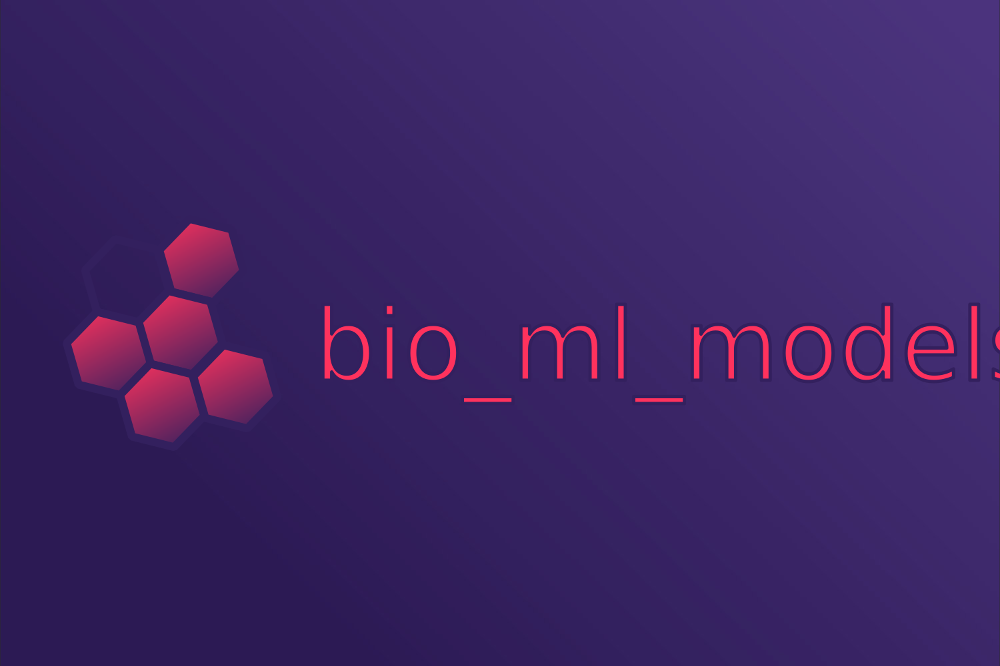

# bio_ml_models

<p align="center">
  
<br />
Collection of prediction models for biological tasks.
</p>

## About

*bio_ml_models* provides an easy-to-use interface to use current, well-tested prediction models for a range of biological
tasks. *bio_ml_models* is designed to be easy to use and understand, well-documented and tested. Sharing your bio-research
model was never that easy before!

## Available Tasks

<details>

<summary><b>Proteins</b></summary>

- **adeno_associated_virus_fitness**: Predict a fitness score for each [AAV capsid protein](https://www.uniprot.org/uniprotkb/P03135/entry) mutation. (1 model(s) available)
- **conservation**: Predict a conservation score for each residue in a protein sequence. (1 model(s) available)
- **gb1_binding**: Predict a binding score for each variant of the GB1 protein. (1 model(s) available)
- **meltome**: Predict the meltome temperature value of a protein. (1 model(s) available)
- **multi_ligand_binding_site**: Predict binding sites of ligands for protein residues. (1 model(s) available)
- **secondary_structure**: Predict the secondary structure for each residue in a protein sequence. (1 model(s) available)
- **single_amino_acid_variant_effect**: Predict if a single amino acid variant of a protein sequence has an effect. (1 model(s) available)
- **sub_cellular_location**: Predict the subcellular location for a protein. (1 model(s) available)

</details>

## Installation

Make sure that you have `python >= 3.9` and [poetry](https://python-poetry.org/docs/#installation) installed.

```shell
poetry install
```

## Usage

The general entrypoint to use the package is to instantiate the collection. *Note that on the first use, this will
download the model data (~250 MB) to your user `.cache` directory:
```python
from bio_ml_models import BioModelCollection

# Load collection
collection = BioModelCollection()  # Automatically downloads model data 
```

The default download URL is `https://biocentral.cloud/downloads/bio_ml_models/model_data_{version}.zip`. If you want
to use another source, you can configure that when creating the collection:
```python
from bio_ml_models import BioModelCollection

# Load collection and download data from custom domain
collection = BioModelCollection(custom_download_url="https://example.com/your-archive.zip")  
```

Here's a [complete example](examples/protein_example.py) how to use `bio_ml_models` 
for predictions, using the `aav_flip` model:
```python
from bio_ml_models import BioModelCollection

from biotrainer.embedders.one_hot_encoding_embedder import OneHotEncodingEmbedder

# Load collection
collection = BioModelCollection()  # Automatically downloads model data

# Attribute-style access
aav_flip = collection.proteins.adeno_associated_virus_fitness.aav_flip

# Dictionary-style access
aav_flip = collection["proteins"]["adeno_associated_virus_fitness"]["aav_flip"]

# Example sequences, shortened from the training set
example_sequences = ["SEPRPIGTRYLTRNL", "EPRPIGTRYLTRNL"]

# Embed
one_hot_encoding_embedder = OneHotEncodingEmbedder()
embeddings = {f"Sequence{i}": one_hot_encoding_embedder.reduce_per_protein(embd) for i, embd in
              enumerate(one_hot_encoding_embedder.embed_many(sequences=example_sequences))}

# Predict and print result
print(aav_flip.predict(input_data=embeddings))
```

## Contributing

We happily welcome contributions!

* Contributing to the code, examples or documentation is always possible via creating an issue or pull request.
* If you want to add a new model or update an existing one, please [get in touch](mailto:sebastian.franz@tum.de).

## Citation

A publication about *bio_ml_models* is under construction. Until then, please cite this repository if you are using 
*bio_ml_models* for your work:

```text
@Online{bio_ml_models,
  accessed = {2024-10-01},
  author   = {bio_ml_models contributors},
  title    = {bio_ml_models - Collection of prediction models for biological tasks},
  url      = {https://github.com/biocentral/bio_ml_models},
}
```